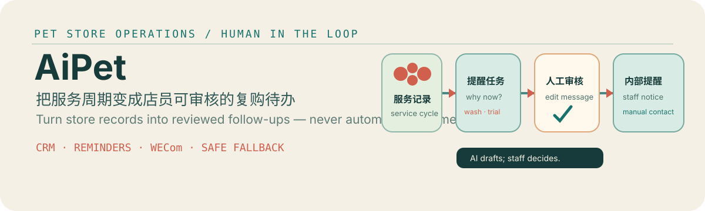

# AiPet

  

  <strong>宠物店 AI 复购提醒助手</strong> 
  Create reviewed follow-up tasks from store records — never automatic customer blasts.

## 这是什么 / What it is

AiPet 是面向宠物门店的轻量级客户运营工具。它聚焦一个日常问题：店员今天应该联系哪些客户、为什么联系、应该怎样组织话术。

AiPet turns customer, pet, appointment, service, and trial records into follow-up tasks. AI can draft a message, but the staff member remains responsible for review and customer contact.

## 核心能力 / What you can do

- 管理客户、宠物、服务、预约、商品购买与试用相关记录。
- 生成洗护到期、沉睡客户和试用装回访等提醒任务。
- 通过 AI 或本地模板生成可编辑的跟进话术，无 API Key 时可离线运行。
- 经营问答百科，覆盖客户沟通、老客召回、活动策划、内容营销、定价、数据、门店管理和养宠知识。
- 自媒体内容日历与营销文案生成器，支持朋友圈、小红书、抖音方向选择、AI 配图、海报卡片和发布记录。
- 7 天运营计划，按客户机会生成每日触达和内容主题。
- CSV 客户导入，支持按手机号幂等更新客户和宠物资料。
- 订阅套餐与 AI 生成额度（Credit）管理，内置试用期状态控制。
- 运营看板：客户机会、触达任务、内容产出、预计挽回营业额。
- 在 CLI 和 Web 今日工作台处理待办。
- 使用企业微信向门店内部员工发送提醒，并支持 dry-run 与发送状态回写。
- 使用 SQLite 本地运行，并为后续 PostgreSQL 迁移保留数据层。

## 工作流 / How it works

1. 门店维护客户、宠物与服务记录。
2. 提醒 Agent 根据服务周期和客户状态生成待办及触发原因。
3. 系统生成 AI 或模板话术。
4. 企业微信只通知门店内部员工。
5. 店员审核、编辑并手动联系客户。

The automation stops at the staff workflow. Customer-facing messages are never bulk-sent automatically in this MVP.

## 快速开始 / Quick start

项目使用 uv 管理 Python 环境和依赖。

~~~powershell
uv sync
uv run python main.py init-db
uv run python main.py seed
uv run python main.py seed --refresh
uv run python main.py dashboard
~~~

查看待办：

~~~powershell
uv run python main.py reminders pending
uv run python main.py push list
~~~

启动 Web 工作台：

~~~powershell
uv run uvicorn web.app:app --reload
~~~

Vue 前端位于 `frontend/`，正常启动时会先构建前端，再由 FastAPI 同一个端口托管页面和 API：

~~~powershell
cd frontend
npm install
npm run build
cd ..
uv run uvicorn web.app:app --host 127.0.0.1 --port 8000
~~~

也可以直接使用一键启动脚本，脚本会先关闭本项目旧的 uvicorn/Vite 进程，只保留当前这一个 Web 服务：

~~~powershell
.\start.bat
~~~

打开 / Open:

- 今日工作台 / Dashboard: http://localhost:8000
- 推送任务 / Push tasks: http://localhost:8000/push-tasks

## 企业微信内部提醒 / WeCom internal notifications

在 .env 中配置门店内部应用。测试和演示时优先使用 dry-run。

开启后访问工作台会先进入 `/login`；未激活时会进入 `/activate`，可输入激活码或先开启 14 天本机试用。

## Phase 1 Daily Operations Loop

Phase 1 adds the sellable daily loop: import customer data, generate explainable outreach opportunities, review or send scripts after compliance checks, record outcomes, and review attributed business impact on the dashboard.

New local modules:

- `licensing/`: local 14-day growth trial, plan-based offline grace, and downgrade mode.
- `outreach/`: 10 default follow-up rules, decision cards, DND/frequency checks, sensitive-word audit, confirmation flow, and guarded WeCom external sends.
- `content_engine/`: 15 Moments/Xiaohongshu/Douyin templates, variable autofill, editable image prompt fallback, and 7-day content calendar data.
- `analytics/`: reply rate, 7-day visit conversion, attributed revenue, recovered revenue, customer health, and tiered dashboard aggregation.
- `aipet-license/`: FastAPI scaffold for the deployable license validation service.

首页现在是店长视角的 **今日工作台**，只回答“今天先做什么”，包含：

- 当前订阅套餐和本月 Credit 用量
- 今日推荐联系客户、待发布推广内容、预计带回收入
- 今日优先动作和快捷入口
- 数据看板独立展示经营漏斗、客户健康、策略效果和关键指标

统一工作台入口：`/` 首页提供左侧一级导航；生成、接待、内容、点评、报告复盘、店铺设置等功能入口均从左侧导航进入，例如 `/outreach`、`/content/calendar`、`/review`、`/weekly-report`、`/settings`。

Vue SPA 中客户搜索只保留在客户管理页；客户管理展示全部客户列表和 CSV 导入，任务中心统一承接推荐今日联系客户与待发布推广内容。

Web API：

~~~text
GET  /api/workbench
GET  /api/customers
GET  /api/appointments
GET  /api/reminders?status=pending
POST /api/reminders/{task_id}/send
POST /api/reminders/{task_id}/friendly-message
GET  /api/samples
POST /api/activity/generate
POST /api/activity/generate-image
POST /api/activity/publish
POST /api/advisor
GET  /
~~~

后台操作入口：

- `/customers/import` 支持下载 CSV 模板、上传前预检、批量创建或更新客户、宠物和洗护周期信息；导入完成后可一键生成今日提醒。
- `/customers` 支持按全部、待跟进、免打扰、最近到店超期筛选客户，可全选当前页或勾选客户后批量生成企业微信内部提醒、批量标记待跟进已发送；也可进入客户档案页查看客户概览、宠物资料、服务记录、待跟进任务和可复制话术，维护标签、备注和免打扰状态。
- `/outreach` 统一承接复购提醒、客户触达、内部推送确认和执行反馈；旧 `/reminders`、`/push-tasks` 入口会导向统一工作台。
- `/content/calendar` 支持生成今日内容、标记朋友圈/小红书/抖音脚本已发布，并记录点赞、评论、转发和咨询数据。
- `/activity` 提供极简营销文案工具：选择抖音、小红书或朋友圈，再选择内容方向，生成 `{ title, body, channel }` 后可复制；也可生成图片，AI 配图调用 `/api/activity/generate-image`，海报卡片由前端 Canvas 生成；最后可通过 `/api/activity/publish` 写入已发布内容记录。
- `/advisor` 是经营问答百科：支持搜索式单次提问和分类推荐问题，后端 `/api/advisor` 兼容 `{"question": "..."}`，也支持可选 `category`（如 `客户沟通`、`活动策划`、`内容营销`），返回 `{"answer": "..."}` 并继续拦截诊疗、用药等医疗问题。

CSV 导入支持以下常用表头：

~~~text
客户姓名,手机号,微信名,宠物名,宠物类型,品种,洗护周期天数,最近到店
~~~

重复导入时，系统会优先按门店内手机号匹配客户，并更新微信名、最近到店和宠物洗护周期，避免产生重复客户。上传前可先点“预检文件”，系统只检查行数和常见格式问题，不会写入数据库。带有“最近到店”的宠物记录会同步生成洗护服务记录，供复购提醒规则使用。

## 订阅套餐

内置四档套餐：

| 套餐 | 月付 | 目标客户 | 核心能力 |
|---|---:|---|---|
| 体验版 | ¥19/月 | 想轻量试用的门店 | 100 Credit，点评回复、基础内容生成 |
| 入门版 | ¥199/月 | 刚开始做私域的小店 | 500 Credit，客户提醒、基础话术、手动复制发送、内容草稿 |
| 专业版 | ¥499/月 | 主力社区宠物店 | 1500 Credit，企业微信、内容日历、客户分层、复购追踪、活动方案 |
| 增长版 | ¥999/月 | 重视私域增长的门店 | 3000 Credit，活动 Agent、自媒体批量生成、周报、体检报告 |

演示数据会自动为门店创建专业版试用订阅。已有旧演示库时，可用 `uv run python main.py seed --refresh` 重建内置的“豆豆宠物店”演示数据。

AI 操作按任务消耗 Credit，例如点评回复 1、经营问答 1、活动/营销文案生成 5、AI 智能配图 3、短视频脚本 3、门店体检 20、每周复盘 20。前端海报卡片不消耗 Credit。Credit 耗尽或试用到期时，系统不会继续生成对应结果。

~~~env
WECOM_CORP_ID=
WECOM_AGENT_ID=
WECOM_APP_SECRET=
WECOM_INTERNAL_NOTIFY_ENABLED=false
~~~

常用操作：

~~~powershell
uv run python main.py push create-internal --follow-task-id 1 --staff-id 1
uv run python main.py push send-internal --dry-run
uv run python main.py push send-internal
~~~

只有 WECOM_INTERNAL_NOTIFY_ENABLED=true 时，send-internal 才会真实调用企业微信。

企业微信登录还需要：

~~~env
WECOM_REDIRECT_URI=https://your-domain/wecom/oauth/callback
WECOM_OAUTH_ENABLED=true
~~~

将回调域名加入企业微信可信域名，并确保应用可见范围包含门店员工。登录入口：

~~~text
http://localhost:8000/wecom/oauth/start
~~~

## 离线模式与合规边界 / Fallback and safety boundaries

没有配置 OPENAI_API_KEY 时，AiPet 使用模板话术继续生成待办，便于本地验证和日常兜底。

本项目不提供宠物健康问诊、疾病诊断、用药建议、治疗建议或医疗图片识别。涉及健康问题时，应建议客户联系专业兽医或正规宠物医院。

All customer-side contact requires staff confirmation and manual sending. WeCom integration is for internal task notification, not automatic external marketing.

## 验证 / Verify

~~~powershell
uv run pytest tests -q
~~~

## 项目结构 / Project map

~~~text
app/        配置、数据库、SQLAlchemy 模型、Pydantic schema
agents/     ReminderAgent、SchedulerAgent、SampleAgent
core/       Prompt 模板与 AgentOrchestrator
frontend/   Vue + Vite 前端工作台，通过 /api/workbench 接入后端数据
web/        FastAPI + Jinja2 工作台、管理页面、API routes
tests/      单元测试和集成测试
main.py     Click + Rich CLI 入口
seed_data.py 演示数据导入
~~~

## 模型配置 / LLM configuration

需要启用 AI 润色时，可在 `.env` 里配置 OpenAI-compatible 模型服务。`MODEL_*` 是当前推荐配置，旧的 `LLM_*` / `LOCAL_LLM_*` 变量仍保留兼容，但会被 `MODEL_*` 优先覆盖：

~~~env
# Local OpenAI-compatible LLM
MODEL_PROVIDER=openai
MODEL_NAME=Qwen3.6-35B-A3B-UD-Q4_K_M.gguf
MODEL_BASE_URL=http://192.168.0.131:9901/v1
MODEL_API_KEY_ENV=OPENAI_API_KEY
OPENAI_API_KEY=local-llm
MODEL_FIXED_NAME=
LLM_TIMEOUT_SECONDS=30
LLM_MAX_TOKENS=300

# Optional image generation for /api/activity/generate-image
OPENAI_BASE_URL=
AIPET_IMAGE_MODEL=dall-e-3
AIPET_IMAGE_SIZE=1024x1024
~~~

本地模型接口按 OpenAI Chat Completions 兼容格式调用，适配 Ollama、LM Studio、llama.cpp、vLLM 等暴露 `/v1` 接口的服务。`MODEL_API_KEY_ENV` 表示从哪个环境变量读取密钥；本地服务不校验密钥时可像示例一样使用 `OPENAI_API_KEY=local-llm`。配置后，洗护提醒和内容草稿会优先使用模型优化说法；接口不可用时自动回退到模板文案。活动页 AI 配图需要可用的 OpenAI-compatible Images API；服务未配置或不可用时，页面会提示改用前端海报卡片。
